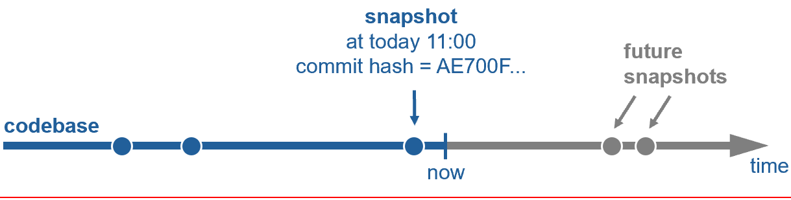

(chap_version_control)=
# We version control everything in one repo

The first thing we need as a software company is a place to store code, documentation, tools, infrastructure-configuration, and other artifacts, e.g., test inputs. In an ideal world, we would put all this data in one version control system that stores a single unambitious snapshot of all our data. 

Such a snapshot could then be identified by a hash, making modifications to its content impossible. Changes to the codebase will create new hashes for new snapshots, leading to an unambitious state of the entire codebase at any given point in time. How to update the codebase will be discussed in [the next chapter](develop_at_head). For now, let us focus on working with one snapshot. 

Remember the bug from the introduction that we need to fix. Our life would be much easier if we can get a snapshot of the whole codebase with the bug in it on our local machine. Ideally, this should be the same snapshot the tester used when she discovered the bug. 

The good news first. We use "Git" in our company. Git is not only the de-facto standard source-code version control tool nowadays. Git also allows us to check out an unambitious source-code snapshot from a repository given only a hash. We can trust Git to do so correctly as this is one of its core design principles to prevent malicious modification of open-source code. 

Now, things get tricky. Our code is not stored in one Git repository. We store our code in several repositories because we believed this would allow us to separate ownership, permissions, and ultimately, create independent versions for all components of our software. The fact is, our codebase is a hugely convoluted monolith. Dependencies between repositories are everywhere and not well-known. 

In such a setup, the effort and tooling needed to synchronize multiple repositories does not pay off. Poly-repos would make sense if we had numerous teams with clearly separated responsibilities plus well-defined and stable interfaces. Then, each team could work in their own "mono-repo". This is the standard way of working in the open-source world nowadays.

Large enterprises with large codebases nowadays mostly go the exact opposite approach for all their internal code: _One_ repository. In our case, **one Git repository for MotionWise 2.0 and all customer projects based on it**. 

You may remember that in the past, Git did not work well with large repositories. All that changed since Microsoft updated Git in late 2022. Working with one large Git repository is now an enjoyable experience. After cloning the repository, you never need to clone again. Modern Git fetches all new updates to this repository in the background, making long waiting times for _git fetch_ a relic of the past even when the internet connection is slow. Now that all your code is one repo, you get atomic snapshots of your whole codebase ordered in time. This means you can go backward and forward from any point in time instantly. Using modern Git, there is no single benefit anymore to storing a monolith in multiple Git repositories instead of subfolders of a single Git repository.

Coming back to the bug that we needed to fix. Now that we have all our code in one Git repository, does checking out the correct snapshot give us an environment where we can reproduce the bug? Unfortunately not, as there is more in our environment than just code:

For our daily work, this means:

1. **We store all build inputs in a single Git repository**. This includes code, tests, configuration, and infrastructure.
2. We serve large binaries via Git-LFS from Artifactory
3. **We consume well-separated internal and external dependencies with stable and clearly defined interfaces as packages linked by a hash** from Artifactory. For example: Python, Gtest, or Python PIP packages. Linking external input by version, filename, or id is not allowed, as this allows the build inputs to change, making the build potentially non-deterministic. 
4. We must not consume build inputs from systems such as MongoDB, Polarion, or ActiveDirectory for the same reason. If required, a copy (or a link by hash) may be added to the codebase in Git via pull request.

The clear goal here is to ensure data integrity by creating a Merkle tree starting from a single Git repository. This means that even if we cannot store everything in one repository because of tool breaks, we version control everything in one repository.

