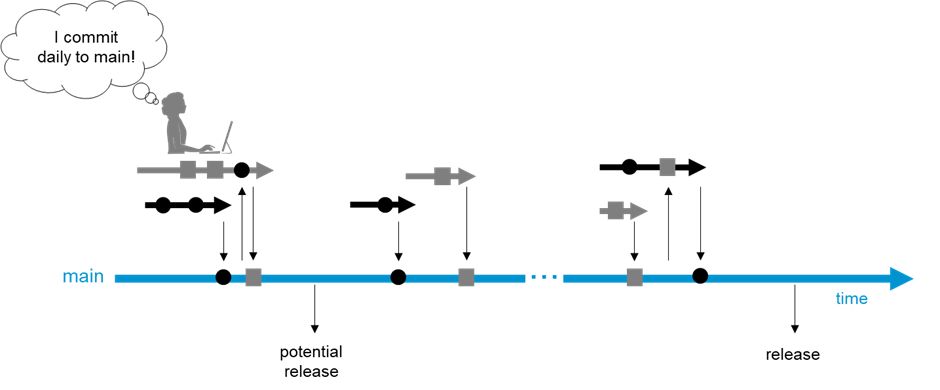

(develop_at_head)=
# We continuously develop at the head of main.

One major driver of inefficiency is having to support and align multiple versions of units, components and tools. 
The de-facto standard vor versioning is SemVer. 
SemVer works well in limited scales. 
However, things get really tricky when not thinking about individual dependencies but very large dependency networks at scale over time. See [^myref] for a very good summary on this topic in case you are interested.

[^myref]: Dependency Management, Titus Winters: [abseil.io/resources/swe-book/html/ch21.html](https://abseil.io/resources/swe-book/html/ch21.html)

Given a huge monolithic codebase in a single repo, our straight-forward 
best-practice solution to conflicting versions is to have __no versions within a repo__. 
Instead, __we merge all changes to the head of main__ (after being tested well enough, [more on that later](chap_build_before_merge)). This style of development is called "Trunk Based Development".

_to be continued ..._