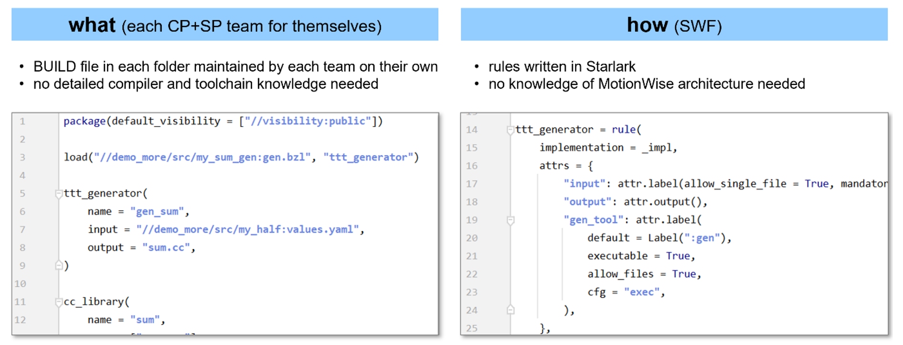

(chap_build_system)=
# We use a build system.

**_Note: this section is an MVP. Tests pass, but functionality is incomplete :-) I will soon improve it._**

For a single developer, a compiler is all needed. Scripts can take a team a bit further.
But at scale, no script is good enough. Build systems have undergone many years of development, making them far more flexible and robust.

Bazel
- **is fast**: do not build things twice if they have already been built somewhere else
- **is correct**: the output faithfully reflects the state of its transitive inputs (hermetic, reproducible, deterministic build analysis and action execution)
- benefits from good architecture and thus guides in that direction
- is widely used by projects of the size of MotionWise
- was explicitly developed for large complex codebases
- has a proven track record even in the automotive environment (BMW)
- has external support from consulting companies and tooling for remote execution, caching, and reporting.

We as TTTech have decided to switch to Bazel as our sole build system for Motionwise to 
- enhance the developer experience 
- reduce feature development time
- increase delivery quality
- end efficient use of our resources

## We limit engineers' power and flexibility

The maybe biggest advantage of a build system
is the clear API that enables us to split work:
 
This has 2 advantages:

Firstly, developers can concentrate on writing code and only need to understand how to write rules.

Secondly, given only a limited set of things that can be done with these rules, the system can optimize the build because certain assumptions always hold true.

For example, if compiling and linking depends on its declared inputs,  the system can find out which steps can be done in parallel and which need to be sequential.

*todo: put in the rules we created for scons here.*
