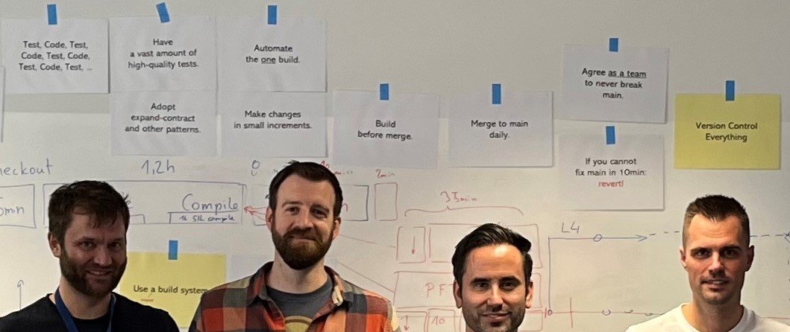

# How we (want to) develop software at scale



Welcome to the high-level guideline we (want to) follow to develop software continuously at the head of a single repository.

```{only} epub
This e-book is work in progress. We did not include internal or confidential information on purpose. Feel free to read it also as webpage [here](https://how-we-dev-sw.readthedocs.io/).  
```
```{only} not epub
This guideline is work in progress. We did not include internal or confidential information on purpose. Feel free to read it in .epub format on your favorite ebook reader [(DOWNLOAD)](https://how-we-dev-sw.readthedocs.io/_/downloads/en/latest/epub/). 
```

## Table of contents

```{eval-rst}
.. toctree::
   :maxdepth: 1

   Welcome to software engineering.<welcome.md>
   We version control everything in one repository.<version_control.md>
   We continuously develop at the head of main.<develop_at_head.md>
   We agree as a team to never break main.<never_break_main.md>
   We build before merge.<build_before_merge.md>
   If we cannot fix main fast, we revert.<revert.md>
   
   We have a vast amount of high-quality tests.<tests.md>
   We Test, Code, Test, Code, Test, Code, ...<tdd.md>
   We release on demand from main.<release.md>
   
   We make changes in small increments.<small_increments.md>
   We merge (something) to main daily.<merge_daily.md>
   We have a "10 min" build.<fast_build.md>
   
   We use a build system.<build_system.md>
   We decouple the codebase.<decouple.md>
   We spend time to educate ourselves.<educate.md>
   To win, we invest in good architecture.<architecture.md>
```

## Who are we

NXP Semiconductors N.V., the worldwide leader in automotive processing and networking, announced in Jan 2025 that it has entered into a definitive agreement to acquire TTTech Auto. [TTTech Auto](https://www.tttech-auto.com/) is a leading platform product and service provider focusing on system, safety, and security for the software-defined vehicle. "[MotionWise](https://www.tttech-auto.com/software-products/motionwise-safety-middleware)" is our next-generation safety middleware solution to provide a safe and deterministic execution environment for mixed-criticality software applications. With our headquarters in Vienna and subsidiaries in Spain, Germany, Serbia, Croatia, and Turkey, we are always searching for excellent engineering potential. Feel free to apply in case you are looking for one of the most incredible places to work on safety-critical embedded-software.

## Disclaimer

The content of this guideline is heavily based on input from the public domain that I have collected over the past years. I hereby declare that, except where not appropriately referenced, nothing in this guideline is my own work. Please excuse me for not remembering all the input and ideas I have collected from various books, conference presentations, YouTube videos, and blogs. All started more than two years ago with [an incredibly inspiring talk from Jakob Ehn](https://www.youtube.com/watch?v=hL1OZfgoZGk&t=105s) on "real developers" commiting to main. Lots of inspiration from [Martin Fowler](https://martinfowler.com/articles/branching-patterns.html), [Dave Farley](https://www.youtube.com/@ContinuousDelivery), and countless others later, we from TTTech want to give back to the community our interpretation of modern embedded-software development. Feel free to [contact me](mailto:sebastian.caban@tttech-auto.com) for new inspiration, concerns, and whatever is on your mind. Feel also free to share this guideline as it is. I hope we can inspire you as others inspired us.
