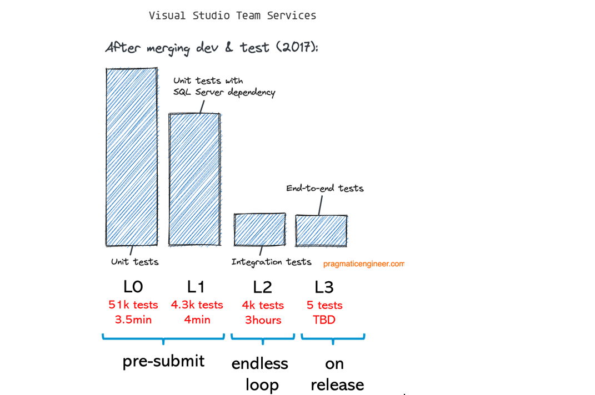

(chap_tests)=
# We have a vast number of high-quality tests.

**_Note: this section is an MVP. Tests pass, but functionality is incomplete :-) I will soon improve it._**

A failing test shall tell you quickly what exactly is wrong without you having to spend much time analyzing the error.

Therefore firstly, **one test should test one (additional) thing** and one (additional) thing only. 
In other words, small tests are preferred over large tests because when they fail, you know exactly where the issue is.
Writing tests for mutually exclusive functionality helps.

Ask yourself: Is there something that can go wrong that only this specific test can detect? 
If not, delete the test!

Secondly, **a test must have a meaningful, descriptive name**. 
It is not enough to describe what the test does (we can read the code).
The name needs to tell us why it does this. 
This helps to decide whether a test should
be updated in line with changed functionality or whether an actual failure that should be fixed has been found.

Thirdly, **a test must have failed at some point in time**. 
How else do you know that the test really tests what it intends to and not just passes all the time?

Fourthly, **tests must be deterministic** in order to trust them.
In case they are not, quarantine them. 

And lastly, don't forget, **tests must be written for people to read**, and only accidentally for machines to execute.

## We characterize tests by the environment in which they need to be executed

We also need to change the way we characterize tests. Currently, we do so by looking if they affect one unit or a component. Tests shall be split by the environment they need to be executed. For example, category "one" are all tests that run in a single process on Linux within 100ms, need no network communication and no hardware. Here another example from Microsoft:
 

The idea is that fast software tests can be run in the local build prior to a merge.
Slower hardware tests shall be run after the submit in an endless loop for example.
