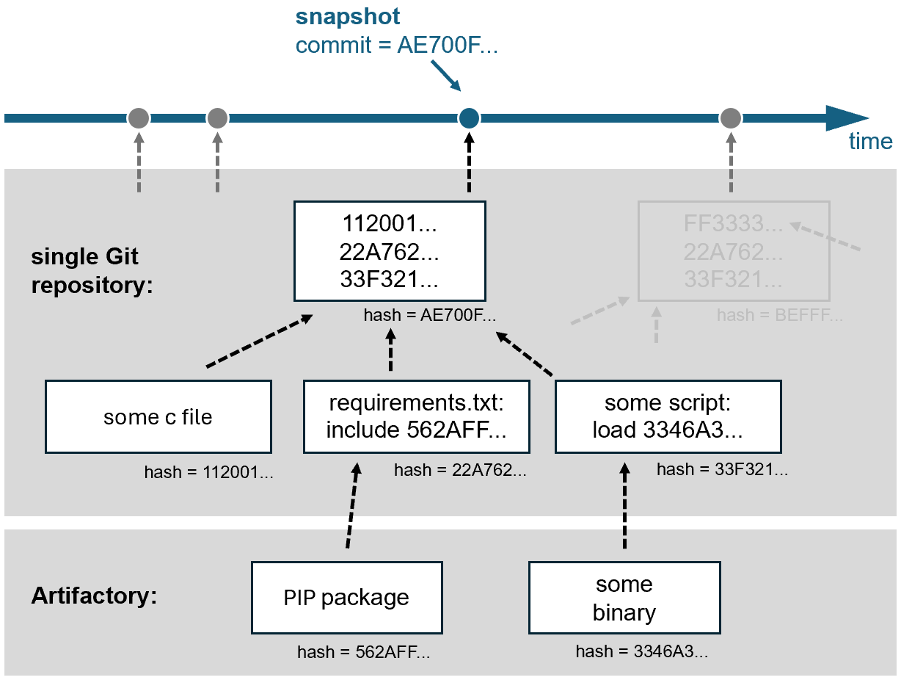
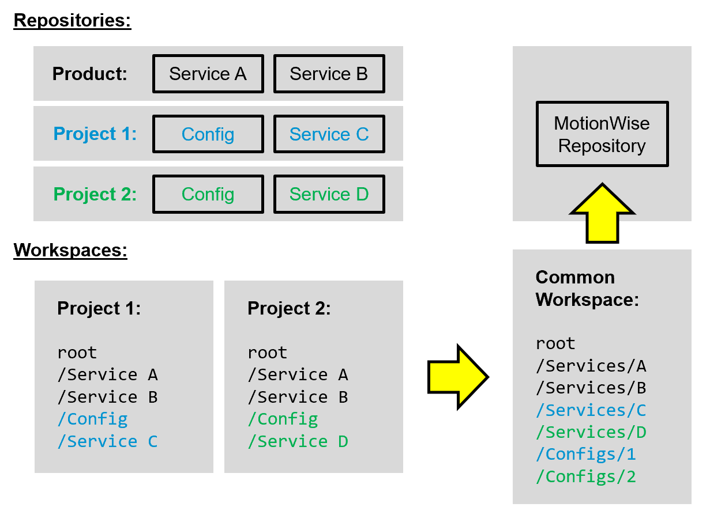

(chap_version_control)=
# We version control everything in one repository.

The first thing we need as a software company is a place to store code, documentation, tools, infrastructure-configuration, and other artifacts, for example, test inputs. In an ideal world, we would put all this data in one version control system that stores a single unambitious snapshot of all our data. 

Such a snapshot could then be identified by a hash, making modifications to its content impossible. Changes to the codebase will create new hashes for new snapshots, leading to an unambitious state of the entire codebase at any given point in time. How to update the codebase will be discussed in [the next chapter](develop_at_head). For now, let us focus on working with one snapshot. 

Remember the bug from the introduction that we needed to fix. Our life would be much easier if we could get a snapshot of the whole codebase with the bug in it on our local machine. Ideally, this should be the same snapshot the tester used when she discovered the bug. 

First, let me tell you the good news: We use "Git" in our company. Git is not only the de-facto standard source-code version control tool nowadays. Git also allows us to check out an unambitious source-code snapshot from a repository given only a hash. We can trust Git to do so correctly as this is one of its core design principles to prevent malicious modification of open-source code. 

## Your life is easier with one repository

Now, things get tricky. Our code is not stored in one Git repository. We store our code in 100+ repositories for two main reasons. Firstly, we wanted small independent components with clear ownership and separated permissions. We thought to achieve that by having small teams that own their repository end-to-end and release new versions frequently. Secondly, we thought that small repositories are easier to clone, pull, merge, and push. The reality, unfortunately, turned out to be different. Our codebase kept being a hugely convoluted monolith. Dependencies between repositories kept growing everywhere and were by no means well-known. Team silos became bigger and worked against building teams with knowledge across the product. Eventually, we soon used some half-baked in-house tooling to put our 100+ repositories back together into a single workspace with each repository being in a subfolder. This made sharing, standardizing, and modifying code across repositories possible again, but because of tooling issues, by no means enjoyable.

Poly-repos would make sense if we had numerous _independent_ teams with clearly separated responsibilities plus well-defined and stable interfaces. Then, each team could work in isolation in their own "mono-repo". This way of working is common in the open-source world nowadays for good reasons. 

Large enterprises nowadays mostly go the exact opposite approach for all their internal code: _One_ repository per product. In our case, **one Git repository for our a product and all customer projects based on it**. This obviously by itself does not make the code better, but having all code together eases the large scale refactorings needed to structure and modularize code. 

You may remember that in the past, Git did not work well with large repositories. All that changed since Microsoft updated Git in late 2022. Microsoft invested significant work to make working in a large Git repository an enjoyable experience. After (partially) cloning a large repository, you never need to clone again. Modern Git fetches all new updates to this repository in the background, making long waiting times for _git fetch_ a relic of the past even when the internet connection is slow. Now that all your code is in one repo, you get atomic snapshots of your whole codebase ordered in time. This means you can go backward and forward from any point in time instantly. Using modern Git, there is no single benefit anymore to storing a monolith in multiple Git repositories instead of subfolders of a single Git repository.

Software development is very opinionated on almost all matters. Especially how to work is subject to constant controversy. A single repository is no exception here. A single repository is a place for large-scale collaboration. Discipline and upholding standard processes is a must to not end in a messy workspace. Proper governance is critical here and often overlooked. Once established, however, a single repository can significantly improve quality and maintainability when required. To summarize, a single repository pays off when software consists of many components with many dependencies, teams shall have end-to-end ownership, including integrating their components, and the system is always deployed together in many configurations. Notably, this is exactly our use case. 

_TODO: True "Mono-repos" have their downsides, so we go for a one-project repo paired with well separated dependencies imported by hash._

## Git + Artifactory is all we need

Coming back to the bug that we needed to fix. Now that we have all our code in one Git repository, does checking out the correct snapshot give us an environment where we can reproduce the bug? Unfortunately not, as there is more in our environment than just code. For our daily work, this means:

1. **We version control all build inputs in a single Git repository**. This means storing code, tests, documentation, configuration, and infrastructure-configuration for a product and all dependent customer projects in one large Git repository.
2. In case we need large binaries in our workspace or for our build, we serve them via Git-LFS, the build-system, or other standard means from Artifactory. Importantly, linking must be done by hash. 
3. **We consume well-separated internal and external dependencies with stable and clearly defined interfaces by hash** from Artifactory. For example: Python, Gtest, Docker images, or Python PIP packages. Linking external input by version, filename, id, tag, or ":latest" is not allowed, as this allows the build inputs to change, making the build potentially non-deterministic. 
4. We must not consume build inputs from systems such as Jira, MongoDB, Polarion, or any cloud service for reproducibility reasons. If required, a copy (or a link by hash to Artifactory) may be added to Git via pull request.
5. **We use the standardized WSL** provided by our company to make the complete development environment reproducible.

All points above ensure data integrity by creating a Merkle tree starting from a single Git repository. This means that even if we cannot store everything in one repository because of tool breaks, we version control everything we need to recreate a snapshot of our environment in one repository.

Now that we have unambiguous snapshots, we can move on to the next step, that is putting our product and all customer projects into this snapshot.

## We work with one common workspace

We currently check out a subset of 100+ repositories for each project into a single project-specific workspace. The mapping of the services checked out to the folders in the workspace is stored in a so-called ".cccf" file. The magic of the checkout is done by a self-baked tool called "Camel."

As usual, self-baked tools work reasonably well in small scenarios but run into scaling problems once the company grows. Firstly, as merging to several independent repositories is not atomic, the current workspace's checkout has lately sometimes been broken. Secondly, looking at the example in the figure above, Project 2 cannot be built with Workspace 1 checked out. Adding the folders of Project 2 to the Project 1 workspace is impossible as the config folders have the same name. So the only choice left is to check out Project 2 in addition and sync the common folders to the other project via Git, leading to a more than full hard disk once all projects need to be checked out. Fortunately, there is a much easier solution:

We create a new _common_ workspace with a unified folder structure. We move conflicting folders into subfolders and use the opportunity to refactor the other folders' structure. The same folder structure is then put 1:1 into our new "product" repository, transforming the self-baked "Camel-checkout" into a simple standard Git-checkout identified by a single commit hash. In case not all folders are needed, a partial clone is possible with Git out of the box. 

Having one unified workspace folder structure checked out from only one repository inside a standardized WSL will make our live a lot easier. In the next chapter, we will see how to update code in this workspace efficiently. 

## Modern Git can handle large repositories well

_TODO: Write about scalar, why .gitignore does not scale, and how few commands are needed when working with one trunk and short-lived branches._